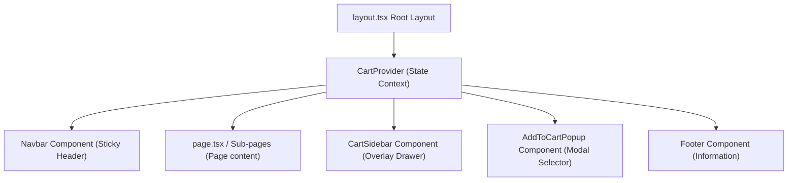

# 🏗️ Architecture & Component Design

This document details the engineering structure, component communication, global state model, and routing architecture of the **Zimpeto Wholesale** application.

---

## 1. Routing & Layout Architecture

The application is built on the modern **Next.js App Router** framework. By separating layouts from pages, Next.js maintains continuous layout states (such as active search queries in the `Navbar` or loaded products in the `CartSidebar`) during page transitions.

### Global Page Container (`src/app/layout.tsx`)

The global layout serves as the frame for all routes:



### Route Breakdown

All routes reside in the `src/app/` directory and map to descriptive endpoints:

- 🏠 **`/`** (`src/app/page.tsx`): Storefront homepage featuring promotion cards, top categories, regional recipes, and CTA grids.
- 🏪 **`/loja`** (`src/app/loja/page.tsx`): Bulk catalogue explorer supporting fullsearch text, category filtering tabs, and price sorting dropdowns.
- 🍲 **`/receitas`** (`src/app/receitas/page.tsx`): Grid of Mozambican culinary delights supporting deep ingredient lists, visual instruction steps, and shopping redirects.
- 💳 **`/checkout`** (`src/app/checkout/page.tsx`): Three-step order processing checkout funnel.
- 📞 **`/contacto`** (`src/app/contacto/page.tsx`): Contact forms, location details, and business hours.
- 🗺️ **`/localizacao`** (`src/app/localizacao/page.tsx`): Detailed maps, transport references, and operational scheduling.
- 🔑 **`/login`** (`src/app/login/page.tsx`): Customer portal mock interface supporting registration and login tab toggling.

---

## 2. Global State Model (`CartContext.tsx`)

The application's business engine is the shopping cart, implemented via a unified React Context at `src/app/context/CartContext.tsx`.

### Context API Overview

The context exposes state properties and dispatch functions, enabling any page component to trigger popups, add items, or read the cart total:

```typescript
interface CartContextType {
  cart: CartItem[];                     // Current items in the cart
  addToCart: (p: Product, q?: number) => void; // Add item with customizable quantity
  removeFromCart: (id: string) => void; // Remove an item entirely
  updateQuantity: (id: string, delta: number) => void; // Increment/Decrement quantity by delta
  cartCount: number;                    // Derived total item count
  cartTotal: number;                    // Derived total monetary value in MT
  isCartOpen: boolean;                  // Controlling the Cart Sidebar drawer visibility
  setIsCartOpen: (v: boolean) => void;
  lastAdded: string | null;             // Toast notification variable
  popupProduct: Product | null;         // Product active inside the bulk selection drawer
  setPopupProduct: (p: Product | null) => void;
  clearCart: () => void;                // Resets the cart state
}
```

### State-to-Component Flow

```text
               +------------------------------------+
               |           CartProvider             |
               | (Cart State, Active Drawer State)  |
               +-----------------+------------------+
                                 |
         +-----------------------+-----------------------+
         |                                               |
         v                                               v
+------------------+                           +--------------------+
|  CartSidebar     |                           |  AddToCartPopup    |
| - Reads cart[]   |                           | - Reads popupProd  |
| - updateQuantity |                           | - Calls addToCart  |
| - removeFromCart |                           | - Closes on submit |
+------------------+                           +--------------------+
```

---

## 3. Core Component Breakdown

### A. Navbar (`src/components/Navbar.tsx`)
- **Sticky Header**: Styled with `sticky top-0 z-50` to stay visible.
- **Fuzzy Search & Autosuggestions**: As the user types in the search input, a filtered list of up to 5 matching products is calculated dynamically from `ALL_PRODUCTS`.
- **Outside Click Handler**: Uses a `useRef` and a `mousedown` event listener to close the suggestions dropdown automatically when a user clicks elsewhere on the page.

### B. CartSidebar (`src/components/CartSidebar.tsx`)
- **Animated Drawer Panel**: Utilizes the `.animate-slideIn` utility class with a smooth cubic-bezier transition.
- **Dynamic Delivery Estimates**: Reads the `cartTotal` to evaluate whether the order exceeds `5,000 MT`. If so, it marks shipping as **"Gratuita"**; otherwise, it shows **"+ A calcular"**, encouraging larger bulk purchases.
- **Quantity Steppers**: Let customers adjust bulk item quantities in real-time, instantly recalculating the totals and item counts.

### C. AddToCartPopup (`src/components/AddToCartPopup.tsx`)
- **Quantity Steppers & Presets**: Reads the `qtdOptions` array from the selected product. If present, it renders rapid quantity selector buttons (e.g., fardos of `1`, `2`, `5`, or `10`), alongside a customizable numeric stepper.
- **Dynamic Saving Displays**: If a product has a defined `oldPrice`, the popup calculates and displays the exact savings for the selected quantity in real-time.

---

## 4. Styling & Custom Design Tokens

The application leverages **Tailwind CSS** with cohesive local branding tokens configured inside `tailwind.config.js`:

### Brand Palette
- 🟢 **`brand.green` (`#004d40`)**: Rich deep emerald representing freshness, organic agriculture, and traditional Mozambican culture (used for headers, primary actions, and branding highlights).
- 🟠 **`brand.orange` (`#ff9800`)**: Bright amber representing sunlight and vibrant local markets (used for promotion highlights, CTAs, and active tabs).
- ⚫ **`brand.dark` (`#1a1a1a`)**: Solid off-black used for professional footers, checkout grids, and text contrast.

### Layout Transitions & Keyframes
Our custom animations, defined in both Tailwind configuration and `src/app/globals.css`, enhance user engagement:
- 💨 **`animate-slideIn`**: Translates the checkout sidebar smoothly from `translateX(100%)` to `0` over `0.32s` using a premium cubic-bezier easing curve (`cubic-bezier(0.4, 0, 0.2, 1)`).
- 🌟 **`animate-fadeIn`**: Slides modals upwards gently (`translateY(8px)`) while transitioning opacity from `0` to `1` over `0.3s`.
